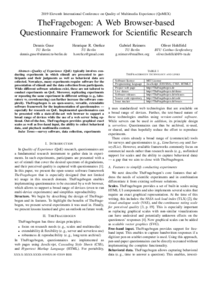
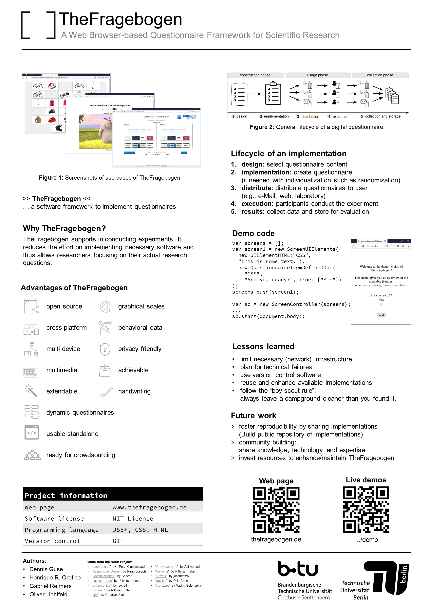

Description
===
TheFragebogen enables you to create _digital questionnaires_.  
A questionnaire is implemented as single-page application using HTML/CSS/JavaScript.
It can be directly executed in a JavaScript-enabled web browser.

The main goal for implementing TheFragebogen was to create a software framework for questionnaires that:
* runs almost everywhere,
* works standalone,
* can be easily extended, and
* can be integrated with other software solutions.

Overview on features
--
* _Simple setup:_ only a JavaScript-enabled web browser is required (HTML5-capability is a plus).
* _Built-in scales:_ a large number of scales is built-in (e.g., [NASA-TLX](https://en.wikipedia.org/wiki/NASA-TLX)).
* _Data export:_ download to the local machine or upload to a web server.
* _Skinning:_ CSS can be used to adjust the design a questionnaire as desired.
* _Connectivity:_ interact via HTTP or [WebSockets](https://en.wikipedia.org/wiki/WebSocket) with other systems.

For an introduction, see:
* the [live demos](demo/),
* the [getting started section](gettingstarted/),
* the [README](https://github.com/TheFragebogen/TheFragebogen/blob/master/README.md), and
* the [source Code](https://github.com/TheFragebogen/TheFragebogen/).

Use cases for scientific research
---
TheFragebogen evolved during conducting scientific research.
The paper _TheFragebogen: A Web Browser-based Questionnaire Framework for Scientific Research_ (2019, QoMEX, Berlin) describes detailed features and use cases.

  
  

